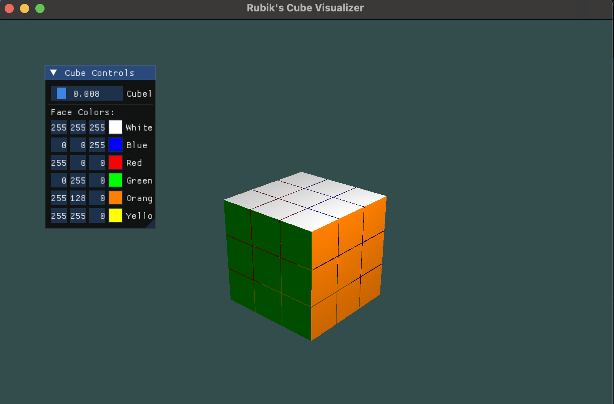

# Cube Solver
A program that will be able to solve any given rubix cube
Using Rubix Cube notation implementation

## OpenGL Render

## Why is this even a project?
- Using low level design techniques such as bitwise operations to speed up the base operations for Rubix cube algorithms without needing supercomputer like powers.
- Implementing an objectively hard problem and using my own optimizatino to learn algorithms and Graphics

## Project revamped after a long hiatus!
- New Things!! Using AI for a lot of implementation since I took a nice time to design a bunch of the architecture for how this should go down.-
- uses rubix cube algorithm notation such as U,F,D,B etc. lowercase of the letter is the normal move, while upper case is prime i.e F is F prime and f is normal f.

## Future Improvements
- Generalize to bigger cubes, using the method of step by step solving methods
- Implement machine learning for smart searching.
-
